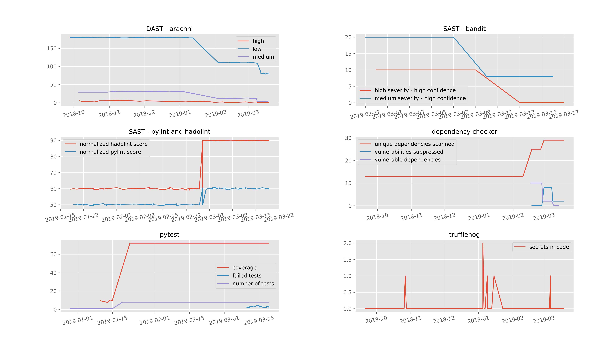

# Light timeseries charts (mainly for quick aggregation of security tools data)

Plot diagrams using arbitrary time series data of the form:

``` csv
time,category,subcategory,measurement
2019-02-17,pytest,coverage,0
2019-03-03,pytest,coverage,78
2019-03-10,pylint,score,8.63
2019-03-17,pylint,score,8.63
2019-02-17,DAST,coverage,2
2019-03-03,DAST,coverage,2
2019-03-03,DAST,untriaged,72
2019-03-10,DAST,untriaged,72
2019-03-17,Dependency Check,critical,720

```

This was created to consolidate counts of security tools vulnerability outputs into simple time series charts as part of a ci/cd pipeline without having to export tool data to a more complex tool such as defectdojo. Instead, data is read a csv file, generating a single png output which can be retrofitted right back to the repository (e.g. in the wiki portion of a gitlab). This allows for quick and inexpensive visual summaries without , where category is a tool and subcategory is a type of finding.  However, it can be used for any arbitrary category and subcategory timeseries you like.



